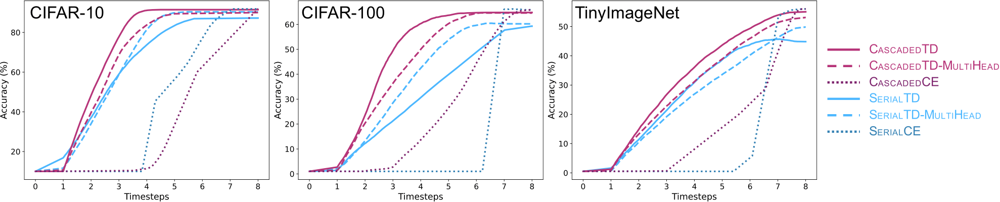

# Improving Anytime Prediction with Parallel Cascaded Networks and a Temporal-Difference Loss

This repository is the official implementation of [Improving Anytime Prediction with Parallel Cascaded Networks and a Temporal-Difference Loss](https://arxiv.org/abs/2102.09808). 

## Requirements

To install requirements:

```
pip install -r requirements.txt
```

## Training
Use `train.sh` as a template to set your own hyperparameters, which launches `train.py`.
In `train.sh`, be sure to specify `DATASET_ROOT`, `EXPERIMENT_ROOT`, and `SPLIT_IDXS_ROOT` to locations on you system where your datasets are located, where you want the output from `train.py` to be written (contains ckpt files, etc.), and the location for the dataset `split_idxs` (train, val, test splits) for reproducibility and consistency, respectively.

To train the model(s), run the `train.sh` script.


## Evaluation
Use `eval.sh` to load and evaluate the model stored in `EXPERIMENT_NAME`. This script will evaluate the performance of the model and, if `--keep_logits` is specified, generate and store the logits for all examples in the specified dataset. The logits are useful for downstream tasks, such as training metacognition models.

Similar to `train.sh`, specify `DATASET_ROOT`, `EXPERIMENT_ROOT`, and `SPLIT_IDXS_ROOT`.

To evaluate the model, run `eval.sh`

Analyze results with `Analysis.ipynb`

## Results

<p>
    
</p>

The key observations from the Figure above, which shows speed-accuracy trade offs for the six models on three data sets, are as follows. First, our canonical cascaded model, CascadedTD, obtains better anytime prediction than SerialTD-MultiHead (i.e., the architecture of SDN). CascadedTD also achieves higher asymptotic accuracy; its accuracy matches that of CascadedCE, a ResNet trained in the standard manner. Thus, cascaded models can exploit parallelism to obtain computational benefits in speeded perception without costs in accuracy.

Second, while MultiHead is superior to SingleHead for serial models, the reverse is true for cascaded models. This finding is consistent with the cascaded architecture's perspective on anytime prediction as unrolled iterative estimation, rather than, as cast in SDN, as distinct read out heads from different layers of the network. Third, models trained with TD outperform models trained with standard cross-entropy loss. Training for speeded responses reorganizes knowledge in the network so that earlier layers are more effective in classifying instances.


## Contact
If you have any questions, feel free to contact us through email (michael.iuzzolino@colorado.edu) or Github issues. Enjoy!